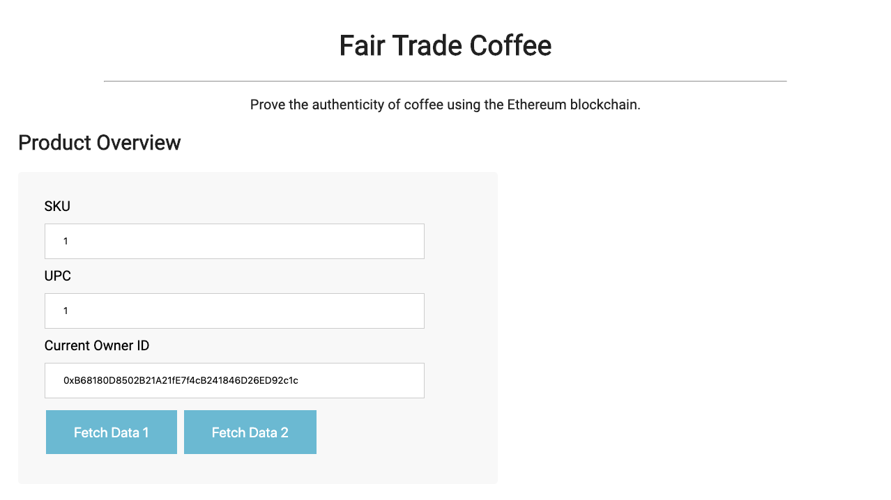
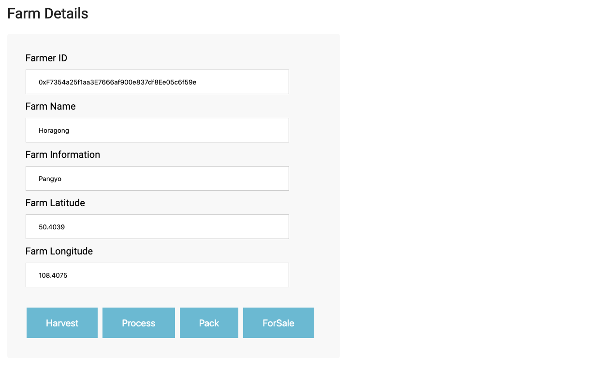
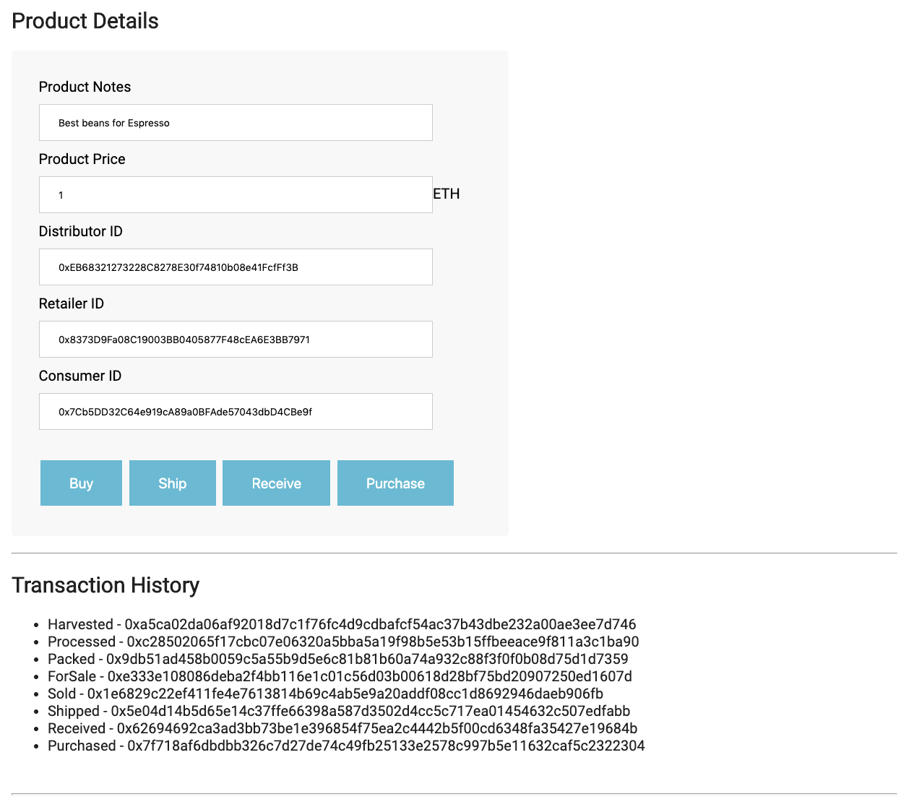

# Supply chain & data auditing

This repository containts an Ethereum DApp that demonstrates a Supply Chain flow between a Seller and Buyer. The user story is similar to any commonly used supply chain process. A Seller can add items to the inventory system stored in the blockchain. A Buyer can purchase such items from the inventory system. Additionally a Seller can mark an item as Shipped, and similarly a Buyer can mark an item as Received.

The DApp User Interface when running should look like...








## Getting Started

These instructions will get you a copy of the project up and running on your local machine for development and testing purposes. See deployment for notes on how to deploy the project on a live system.

### Prerequisites

Please make sure you've already installed ganache-cli, Truffle and enabled MetaMask extension in your browser.


### Installing

A step by step series of examples that tell you have to get a development env running

#### Clone this repository:


#### Launch Ganache:

```
ganache-cli -m "${your seeds}"
```


#### In a separate terminal window, Compile smart contracts:

```
truffle compile
```

This will create the smart contract artifacts in folder ```build\contracts```.

#### Migrate smart contracts to the locally running blockchain, ganache-cli:

```
truffle migrate
```

Your terminal should look something like this:

```
Starting migrations...
======================
> Network name:    'development'
> Network id:      1561010761397
> Block gas limit: 6721975


1_initial_migration.js
======================

   Replacing 'Migrations'
   ----------------------
   > transaction hash:    0x4f25512d0a525c2cd2be59b235a750b609d88d71ddca3a0ec6e5909fa98857fd
   > Blocks: 0            Seconds: 0
   > contract address:    0xe16CA31192c3bf8AF60097F3a3e9879c3009BCd4
   > account:             0xB68180D8502B21A21fE7f4cB241846D26ED92c1c
   > balance:             99.91155946
   > gas used:            284908
   > gas price:           20 gwei
   > value sent:          0 ETH
   > total cost:          0.00569816 ETH


   > Saving migration to chain.
   > Saving artifacts
   -------------------------------------
   > Total cost:          0.00569816 ETH


2_deploy_contracts.js
=====================

   Replacing 'FarmerRole'
   ----------------------
   > transaction hash:    0x6ea2f57a6cc91f92e2e3b0e0e99407d9688cc9311a85c8880485688d577a387e
   > Blocks: 0            Seconds: 0
   > contract address:    0xCADf270561d9093a61c865B8704a57E5Bc60Ad67
   > account:             0xB68180D8502B21A21fE7f4cB241846D26ED92c1c
   > balance:             99.90281672
   > gas used:            395103
   > gas price:           20 gwei
   > value sent:          0 ETH
   > total cost:          0.00790206 ETH


   Replacing 'DistributorRole'
   ---------------------------
   > transaction hash:    0xf051e260d7d4a69f75f42970d5172b1b9e60a21d05e2604e9a55a6f03ebee9f0
   > Blocks: 0            Seconds: 0
   > contract address:    0x034b5dB26DC49440bA955a83dFCe07e88910e424
   > account:             0xB68180D8502B21A21fE7f4cB241846D26ED92c1c
   > balance:             99.89491466
   > gas used:            395103
   > gas price:           20 gwei
   > value sent:          0 ETH
   > total cost:          0.00790206 ETH


   Replacing 'RetailerRole'
   ------------------------
   > transaction hash:    0x03f039522ba744a0cc50b659005dea0950dc7ca8e3fa15425cb4235bf0ce6c83
   > Blocks: 0            Seconds: 0
   > contract address:    0x8933360D44887c9D83C5Ec954727E303215c6496
   > account:             0xB68180D8502B21A21fE7f4cB241846D26ED92c1c
   > balance:             99.88700876
   > gas used:            395295
   > gas price:           20 gwei
   > value sent:          0 ETH
   > total cost:          0.0079059 ETH


   Replacing 'ConsumerRole'
   ------------------------
   > transaction hash:    0x8117e630b274817b57d448afb3038ffeb6358bd3ff3c55c20189abc4a5f43cbe
   > Blocks: 0            Seconds: 0
   > contract address:    0x863AE989FB8F17114dC2443970E0034e0DdB4Fd1
   > account:             0xB68180D8502B21A21fE7f4cB241846D26ED92c1c
   > balance:             99.8791067
   > gas used:            395103
   > gas price:           20 gwei
   > value sent:          0 ETH
   > total cost:          0.00790206 ETH


   Replacing 'SupplyChain'
   -----------------------
   > transaction hash:    0x4b459a2a6a36a7675e7bcd8002bb170b97099aed074cb7f82307a76c31d4b067
   > Blocks: 0            Seconds: 0
   > contract address:    0x05b92D3D5b1f964BB7d2131E141a0e3dBf89dFA0
   > account:             0xB68180D8502B21A21fE7f4cB241846D26ED92c1c
   > balance:             99.83505592
   > gas used:            2202539
   > gas price:           20 gwei
   > value sent:          0 ETH
   > total cost:          0.04405078 ETH


   > Saving migration to chain.
   > Saving artifacts
   -------------------------------------
   > Total cost:          0.07566286 ETH


Summary
=======
> Total deployments:   6
> Final cost:          0.08136102 ETH
```

#### Test smart contracts:

```
truffle test
```
All 10 tests should pass like this.

```
Using network 'development'.

ganache-cli accounts used here...
Contract Owner: accounts[0]  0xB68180D8502B21A21fE7f4cB241846D26ED92c1c
Farmer: accounts[1]  0xF7354a25f1aa3E7666af900e837df8Ee05c6f59e
Distributor: accounts[2]  0xEB68321273228C8278E30f74810b08e41FcfFf3B
Retailer: accounts[3]  0x8373D9Fa08C19003BB0405877F48cEA6E3BB7971
Consumer: accounts[4]  0x7Cb5DD32C64e919cA89a0BFAde57043dbD4CBe9f


  Contract: SupplyChain
    ✓ Testing smart contract function harvestItem() that allows a farmer to harvest coffee (183ms)
    ✓ Testing smart contract function processItem() that allows a farmer to process coffee (83ms)
    ✓ Testing smart contract function packItem() that allows a farmer to pack coffee (78ms)
    ✓ Testing smart contract function sellItem() that allows a farmer to sell coffee (83ms)
    ✓ Testing smart contract function buyItem() that allows a distributor to buy coffee (115ms)
    ✓ Testing smart contract function shipItem() that allows a distributor to ship coffee (67ms)
    ✓ Testing smart contract function receiveItem() that allows a retailer to mark coffee received (100ms)
    ✓ Testing smart contract function purchaseItem() that allows a consumer to purchase coffee (103ms)
    ✓ Testing smart contract function fetchItemBufferOne() that allows anyone to fetch item details from blockchain
    ✓ Testing smart contract function fetchItemBufferTwo() that allows anyone to fetch item details from blockchain


  10 passing (934ms)

```

### rinkeby network
#### transaction hash:
0x334dfef5167053a171d49b5101c8fc04bbac3eed7793ac2906f4fb8a6a5a6c33

#### contract address:
0xD4eaCEE8B365Bf1A3Fc46F9F1579B23156E1Bbf6


```
Starting migrations...
======================
> Network name:    'rinkeby'
> Network id:      4
> Block gas limit: 7090424


1_initial_migration.js
======================

   Replacing 'Migrations'
   ----------------------
   > transaction hash:    0x180ed223ff2e1dda297a72e2aaf0608c376c7bbb2672e7dfbc29a27783029362
   > Blocks: 1            Seconds: 21
   > contract address:    0xdfd664C0c31671Ab3B4B40cC0c031544442181e8
   > account:             0xB68180D8502B21A21fE7f4cB241846D26ED92c1c
   > balance:             0.19976711
   > gas used:            284908
   > gas price:           10 gwei
   > value sent:          0 ETH
   > total cost:          0.00284908 ETH


   > Saving migration to chain.
   > Saving artifacts
   -------------------------------------
   > Total cost:          0.00284908 ETH


2_deploy_contracts.js
=====================

   Replacing 'FarmerRole'
   ----------------------
   > transaction hash:    0x34c3ede41c0b8d7fa048addf5d8794c9db837e333bc288fb3e1c9d54eed8afe1
   > Blocks: 1            Seconds: 13
   > contract address:    0xEA869248aa531c236d84FECa9D48Fc869942B5db
   > account:             0xB68180D8502B21A21fE7f4cB241846D26ED92c1c
   > balance:             0.19539574
   > gas used:            395103
   > gas price:           10 gwei
   > value sent:          0 ETH
   > total cost:          0.00395103 ETH


   Replacing 'DistributorRole'
   ---------------------------
   > transaction hash:    0xe885012e332c5f8eddc6d70142fe75025c180d715fa886bdd4a9b9ffc6c7550c
   > Blocks: 0            Seconds: 9
   > contract address:    0xfB02A5C74Afd3501a4c48696D9F11073e626CA46
   > account:             0xB68180D8502B21A21fE7f4cB241846D26ED92c1c
   > balance:             0.19144471
   > gas used:            395103
   > gas price:           10 gwei
   > value sent:          0 ETH
   > total cost:          0.00395103 ETH


   Replacing 'RetailerRole'
   ------------------------
   > transaction hash:    0x68ad9aa4195091bdf5219d1b2afd5dd1b9592b412a916817cb9e92274dee9418
   > Blocks: 0            Seconds: 9
   > contract address:    0x3807FD03bfC07954cfe87e00921A3772213aB39e
   > account:             0xB68180D8502B21A21fE7f4cB241846D26ED92c1c
   > balance:             0.18749176
   > gas used:            395295
   > gas price:           10 gwei
   > value sent:          0 ETH
   > total cost:          0.00395295 ETH


   Replacing 'ConsumerRole'
   ------------------------
   > transaction hash:    0xdf9b075b3b19512b050b8f79bb235613a08054a7713be8edf620d5c7f56cbc89
   > Blocks: 2            Seconds: 41
   > contract address:    0xeF22007FB995bc7d909094e8993e928d76d422bd
   > account:             0xB68180D8502B21A21fE7f4cB241846D26ED92c1c
   > balance:             0.18354073
   > gas used:            395103
   > gas price:           10 gwei
   > value sent:          0 ETH
   > total cost:          0.00395103 ETH


   Replacing 'SupplyChain'
   -----------------------
   > transaction hash:    0x334dfef5167053a171d49b5101c8fc04bbac3eed7793ac2906f4fb8a6a5a6c33
   > Blocks: 0            Seconds: 9
   > contract address:    0xD4eaCEE8B365Bf1A3Fc46F9F1579B23156E1Bbf6
   > account:             0xB68180D8502B21A21fE7f4cB241846D26ED92c1c
   > balance:             0.16151534
   > gas used:            2202539
   > gas price:           10 gwei
   > value sent:          0 ETH
   > total cost:          0.02202539 ETH


   > Saving migration to chain.
   > Saving artifacts
   -------------------------------------
   > Total cost:          0.03783143 ETH


Summary
=======
> Total deployments:   6
> Final cost:          0.04068051 ETH
```

#### In a separate terminal window, launch the DApp:

```
npm run dev
```

## Built With

* [Ethereum](https://www.ethereum.org/) - Ethereum is a decentralized platform that runs smart contracts
* [IPFS](https://ipfs.io/) - IPFS is the Distributed Web | A peer-to-peer hypermedia protocol
to make the web faster, safer, and more open.
* [Truffle Framework](http://truffleframework.com/) - Truffle is the most popular development framework for Ethereum with a mission to make your life a whole lot easier.


## Authors

See also the list of [contributors](https://github.com/your/project/contributors.md) who participated in this project.

## Acknowledgments

* Solidity
* Ganache-cli
* Truffle
* IPFS
